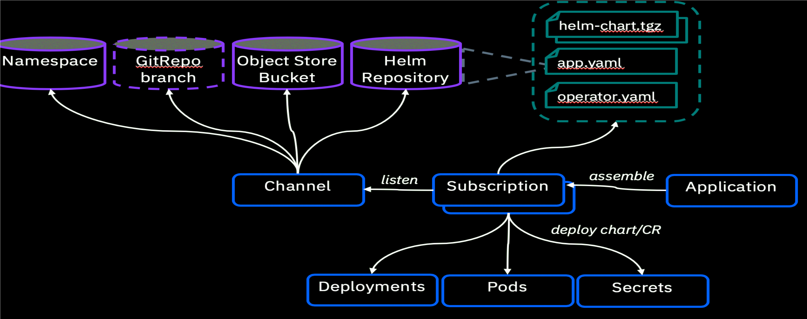

# Converting a Cloud Native Application to a Multicloud Management Application 

## Overview 

The following document will walk through the process of defining 5 custom resource definitions to create and manage an MCM Application. By defining these resources we can install, delete and update resources on the managed MCM clusters. When these MCM resources are created the changes are applied on the target MCM cluster via the MCM Klusterlet. For this example we will be walking through the steps needed to deploy an Nginx MCM Application in a targeted Cluster. A diagram of how the resources work together to make an MCM Application can be seen below: 



## Creating an MCM Application 

### Channels

The channel resource defines the location of a resource to be deployed. These resources can be a Helm repository, Kubernetes namespace, Object store or Git repository. For this example we will be using a GitHub resource. Lets take a look at the 00-channel.yaml file and see what each section is. 

```yaml
# Create a Namespace to hold the Channel
apiVersion: app.ibm.com/v1alpha1
kind: Channel
metadata:
  name: nginx-channel
  namespace: nginx-channel
spec:  
    type: GitHub
    pathname: https://github.com/ldesrosi/cp4mcm-nginx-app.git 
```

When creating a Channel Yaml file you wan to specify the following: 

* **apiVersion**: Contains the MCM API version for the Channel resource.
  * Required. Set the value to `app.ibm.com/v1alpha1`.
* **kind**: Specifies that this is an Channel resource type.
  * Required. Set the value to `Channel` to indicate that the resource is a channel.
* **metadata**: Contains the resource name and and it's namespace.
  * name: Required. The name of the channel, we chose to go with nginx-channel
  * namespace: Required. The namespace for the channel. We want this channel in our nginx-channel namespace. 
* **spec.kind**: Required. The channel type. The supported types are: `Namespace`, `HelmRepo`, `GitHub`, and `ObjectBucket`. We will be specifying this channel as a `GitHub` Channel. 
* **spec.pathname**: Required for `HelmRepo`, `GitHub`, and `ObjectBucket` channels. For a `GitHub` channel, set the value to be the HTTPS URL for the GitHub repository. This is where the artifacts for the app can be found. The artifacts don't need to be in a deployable yaml, but can be discovered by the MCM cluster. 

### Placement Rule 

Normally, to deploy an application to multiple clusters, you would need to run the following steps on each cluster:

- Login to get the kubernetes context.
- Run the `helm install` command.

This does not seem like a lot of work for 2 or 3 clusters. But the  more clusters you have to work with, the more credentials you have to  remember and manage. Also, if you are using CI/CD pipelines to deploy  your workloads, the more clusters you have, the more pipelines you have  to write and embed those credentials to, which can lead to human errors. If those credentials were to change, you would have to update those  credentials wherever they are being used, which can get hard to track.

By leveraging MCM, access to your clusters is managed from a central location. MCM expands on this capability with `Placement Policies` by allowing you to deploy workloads through it by specifying cluster labels, which are much easier to remember and manage. By adopting MCM  into your CI/CD pipelines, you only have to remember the credentials for the MCM Hub cluster. To deploy workloads to multiple clusters, you only have to provide the number of application replicas and the cluster  labels that match the clusters that you would like to deploy them to.

Lets inspect our 01-placement-rule.yaml: 

```yaml
apiVersion: app.ibm.com/v1alpha1
kind: PlacementRule
metadata:
  name: nginx-placement-rule
  namespace: nginx-app
  labels:
    name: nginx-placement-rule
    app: nginx-app
spec:
  clusterReplicas: 1
  clusterConditions:
    - type: OK
  clusterLabels:
    matchLabels:
      environment: Dev
    
```


* **apiVersion**: Contains the MCM API version for PlacementPolicy.

  * Required. Set the value to `app.ibm.com/v1alpha1`.

* **Kind**: Specifies that this is an `PlacementPolicy` resource type.

  * Required. Set the value to `PlacementRule` to indicate that the resource is a placement rule.

* **metadata**: Contains the resource name and some labels

  * name: Required. The name for identifying the placement rule.
  * namespace: Required. The namespace resource to use for the placement rule.
  * Labels: Optional. The labels for the placement rule.

* **spec.clusterReplicas**:  Optional, contains the number of replicas (application instances) to deploy.

* **spec.clusterConditions**: Optional. Define any conditions for the cluster.

  * Specify that you only want to deploy this application to a cluster that that is healthy by adding type with value OK. 

* **spec.clusterLabels.matchLabels**: Contains the list of labels and values that clusters must have for MCM to deploy applications to them.

  * Optional. The labels that must exist for the target clusters.

  ## Subscription

  You can create and manage subscriptions to identify, retrieve, and  deploy new and updated resources to managed clusters. By using  subscriptions, you can improve the continuous delivery capabilities of  your application management.

  Subscription resources can point to a channel for identifying new and  updated Helm charts or Kubernetes resources for deployment. The  subscription operator then watches the channel for new and updated  charts and deployables. When a new or updated Helm chart or Kubernetes resource is detected, the subscription  operator downloads the Helm release version for the specified Helm chart version or the specified Kubernetes resource. The subscription operator can download these objects directly, or as deployables, from the storage location to target managed  clusters without checking the Hub cluster first.

  Lets inspect our 02-subscription.yaml file. 

  ```yaml
  
  apiVersion: app.ibm.com/v1alpha1
  kind: Subscription
  metadata:
    name: nginx-sub
    namespace: nginx-app
    labels:
      app: nginx-app
  spec:
    channel: nginx-channel/nginx-channel
    placement:
       placementRef:
        name: nginx-placement-rule
        kind: PlacementRule
        group: app.ibm.com
  ```

  

* **apiVersion**: Contains the MCM API version for the Deployment resource. 

  * Required. Set the value to `app.ibm.com/v1alpha1'.

* **kind**: Specifies that this is an Deployment resource type.

  * Required. Set the value to `Subscription` to indicate that the resource is a subscription.

* **metadata**: Contains the resource name and some labels. 

  * name: Required. The name for identifying the placement rule.
  * namespace: Required. The namespace resource to use for the placement rule.
  * Labels: Optional. The labels for the placement rule.

* **spec.channel**: Optional. The NamespaceName ("Namespace/Name") that defines the channel for the subscription. Define either the `channel`, or the `source`, or the `sourceNamespace` field. In general, use the `channel`              field to point to the channel instead of using the `source` or `sourceNamespace` fields. If more than one field is defined, the first field that is defined is used.

* **spec.placement.placementRef**: Optional. Defines the placement rule to use for the subscription. Use only one of `clusters`, `clusterSelector` , or `placementRef` to define where your subscription is to be placed for a multi-cluster. If your cluster is a stand-alone cluster that is not your Hub cluster, you can also use `local`.

  * name: Optional, but required for using a placement rule. The name of the placement rule for the subscription.
  * kind: Optional, but required for using a placement rule. Set the value to `PlacementRule` to indicate that a placement rule is used for deployments with the subscription.
  * group: MISSING 

  ## App

  In order for MCM to recognize your workloads as an MCM application, you have to create an `Application` resource. The `Application` resource lets you specify criteria to associate Kubernetes resources to your application so that MCM can manage and monitor them. Lets look at your 03-app.yaml file. 

  

  ```yaml
  apiVersion: app.k8s.io/v1beta1
  kind: Application
  metadata:
   name: nginx-app
   namespace: nginx-app
   labels:
    name: nginx-app
    app: nginx-app 
  spec:
   componentKinds:
   - group: app.ibm.com/v1alpha1
     kind: Subscription
   selector:
    matchLabels:
     app: nginx-app
  ```

  

  * **apiVersion**: Contains the Community SIG API version for Applications.

    * Required. Set the value to `app.k8s.io/v1beta1`.

  * **kind**: Specifies that this is an `Application` resource type.

    * Required. Set the value to `Application` to indicate the resource is an application resource.

  * **metadata**: Contains the resource name and some labels.

    * name: Required. The name for identifying the application resource.
    * namespace: The namespace resource to use for the application.
    * Labels: Optional. The labels for the deployable.

  * **spec.selector.componentKinds**: Contains a list of the kinds of resources to be associated with the application.

    * Optional. The list of the kinds of resources to be associated with the application.

  * **spec.selector.matchLabels.app**

    * MISSING

  ## Image Policy 

  If you have IBM Container Image Security Enforcement enabled in your MCM cluster, you can limit where images are allowed to be pulled from by specifying the allowed repositories to use. Lets see our image-policy.yaml file. 

  ``` yaml
  
  apiVersion: securityenforcement.admission.cloud.ibm.com/v1beta1
  kind: ClusterImagePolicy
  metadata:
    name: nginx-app
    namespace: nginx-app
  spec:
    repositories:
      # allow all images
      - name: "*"
        policy:
  ```

  * **apiVersion**: Contains the security enforcement API version for the Image Policy resource. 
    * Required: securityenforcement.admission.cloud.ibm.com/v1beta1. IBM Container Image Security Enforcement has to be enabled for your MCM cluster.
  * **kind**: Specifies that this is an Image Security resource type.
    * Required: The type of image 
  * **metadata**: Contains the resource name and some labels.
    * name: Required. The name for identifying the application resource.
    * namespace: The namespace resource to use for the application.
  * **spec.repositories**
    * name: name of the repository you would like to use. By setting the name as a wildcard "*" of the repository, you are allowing images to be pulled from any repository. 

## Creating our MCM Application  

Now that we have covered our resources and know what each of them do, we can go ahead and deploy our Nginx MCM App on an Openshift Cluster by following the steps below: 

1. Login to your OpenShift environment by copying your login credentials from the Openshift UI.

   `oc login --token=<your_token> --server=<server url>`

2. Clone the github repo and open the resource directory.

   `git clone https://github.com/ldesrosi/cp4mcm-nginx-mgmt.git `

   ` cd resources `

3. Create `nginx-app` and `nginx-channel` namespaces which are going to be used to work on the artifacts.

   `oc new-project nginx-app` 

   `oc new-project nginx-channel`

4. If you have IBM Container Image Security Enforecement enabled and would like to allow all repos to be used run the following command. 

   `oc apply -f ../policies/image-policy.yaml`

5. Create your channel. 

   `oc apply -f 00-channel.yaml`

6. Crate your Placement Rule by running the following command. 

   `oc apply -f 01-placement-rule.yaml`

7. Create your subcription with the following command. 

   `oc apply -f 02-subscription.yaml`

8. Create your application resource with the following oc command. 

   `oc apply -f 03-app.yaml`

This will not deploy the application to a targeted cluster as the placement rule has to be met first. For our placement rule, there needs to be a healthy targeted cluster with the label `environment` set to `Dev`. Once a targeted cluster meets this criteria, the application will then be deployed to that cluster.

Note that this repository does NOT contain any NGINX deployment.  Instead the 00-channel.yaml contains a GitHub repo that will be used by MCM to clone and instrument the standard NGINX deployment with the MCM instructions.

